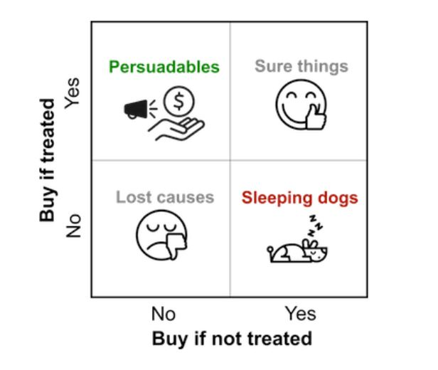
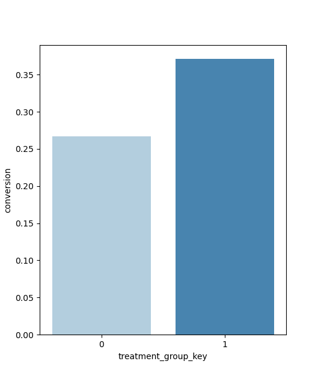
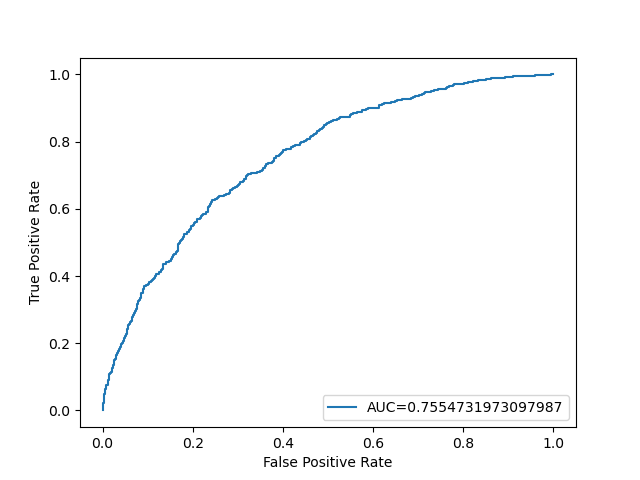
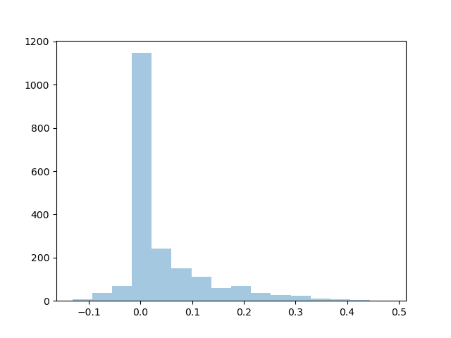

# Who-Is-More-Likely-To-Buy
Uplift Modeling to identify the pursuable group of customers from all the users in order to send them encouragement (in terms of coupons or other offers) to buy the product more without spending resources to convert those users who are not willing or interested to buy the product even after encouragement.

## Uplift Modeling

### Introduction

A modeling technique that aims to find the subset of customers that would be most influenced by the action and create business value. Identifying these segments of user can substantially improve the returns on the inverstments made.

Let's take an example where a company wants to send marketing emails to their users. We would expect that the users whom we are sending the emails will buy more or increase conversion rate. Although this could be true for the entire population. But if we try to dig deeper in the user behaviour, we will find out that there is a segment of user who are sleeping dogs i.e. who does not get affected by the marketing emails or any kind of emailers. There could be another type of users who will definitely buy the product (or convert). They are called Sure things. There could be another segment of users who won't buy a product after receive the emails. They are called Lost Causes. And at last, there are users who will make a purchage (or conversion) on receiving the emails. They are called Pursuables. 

    

The goal of uplift modeling is to identify these groups. We have to find persuables and make efforts for their purchase (or conversion). We should not waste our resources on Sleeping dogs and Sure Things. We would never want to bother Lost Cause.

Now since we haved to find if our promotional campaign is working or not, we can think of the problem as controlled randomized experiment where we are treating (or sending promotions) to a certain group of users i.e. the treatment group and not performing any action or treatment on another set of users i.e. control group. If we observe the the average purchase is higher in the treatment group than the control group, that means the promotion is encouraging users to purchase more. This is called Average Treatment Effect a.k.a ATE.

However, there may be certain set of users who are actually making a purchase and they are causing the overall increase in the treatment group. If through someway we are able to identify if those purusable customers ahead of time, then we woluld be able to conventrate out resources on them. 

The process of determining the variable treatment effect from person to person, conditional on the different traits these people have, we are looking for indivisual treatment effect (ITE), also called the conditional average treatment effect (CATE). This is where Machine Learning and predictive power is used.

### Technique

A classical technique to find Indivisual Treatment Effect is to find the indivisual likelihood, what if they were treated and not treated. These two probabilites are then subtracted to obtain the uplift: how much more likely is a purchase if the treatment is given? 

The modeling can be accomplished in two ways:

- One method is to create two instances of each data point, one with treatment = 1 and treatment = 0. This is called the 'S-Learner', approach since it is a Single model

- Other method is to create two separate models. In the inference phase, treatment and control models are both used to obtain predictions for each instance. This approach is called 'T-Learner' approach since it uses two models. 

## Dataset Description

This is a synthetic dataset created for research purpose. 
  
Synthetic Data Set for Uplift Modeling [Data set]. Zenodo. https://doi.org/10.5281/zenodo.3653141

<table>

<tr><th>S No.</th><th>Feature Name</th><th>Feature Description</th></tr>
<tr><td>1</td><td>treatment_group_key</td><td>Experiment group label</td></tr>
<tr><td>2</td><td>conversion</td><td>Outcome variable</td></tr>
<tr><td>3</td><td>x1_informative</td><td>informative feature</td></tr>
<tr><td>4</td><td>x2_informative</td><td>informative feature</td></tr>
<tr><td>:</td><td>:</td><td>:</td></tr>
<tr><td>11</td><td>x9_informative</td><td>informative feature</td></tr>
<tr><td>12</td><td>x10_informative</td><td>informative feature</td></tr>

<tr><td>13</td><td>x11_irrelevant</td><td>irrelevant feature</td></tr>
<tr><td>14</td><td>x12_irrelevant</td><td>irrelevant feature</td></tr>
<tr><td>:</td><td>:</td><td>:</td></tr>
<tr><td>31</td><td>x29_irrelevant</td><td>irrelevant feature</td></tr>
<tr><td>32</td><td>x30_irrelevant</td><td>irrelevant feature</td></tr>

</table>

## Exploratory Data Analysis

Data points in each of the two groups (Control and Treatment)

<table>
<tr><th>Groups</th><th>Data points</th></tr>
<tr><td>Control</td><td>5000</td></tr>
<tr><td>Treatment</td><td>5000</td></tr>
</table>

Percentage of conversions in the two groups (Control and Treatment)

<table>
<tr><th>Groups</th><th>Conversion Rate</th></tr>
<tr><td>Control</td><td>0.2670</td></tr>
<tr><td>Treatment</td><td>0.3712</td></tr>
</table>

Let's obeserve the proportion Z-test results among the two groups.
 
<table>
<tr><th>Statistic</th><th>Values</th></tr>
<tr><td>Z-stat</td><td>-11.17</td></tr>
<tr><td>P-value</td><td>5.27e-29</td></tr>
</table>
 
**Observations:**

- The data points are randomized and equally distributed among control and treatment groups.
- The ATE (Average Treatment Effect) is positive and is approximately 10%. 
- From the proportion Z-test between the two groups, we observed that the difference in the conversion between the two groups is significant as the p-value is less than 0.05.

These observations clearly states that we can move ahead with the uplift modeling. We will be creating a machine learning model to classify users based on how likely they will be purchase the product. Once we build the model, we will use the model to estimate the difference between the conversion of indivisual to see who are likely to get converted under treatment conditions. 
 
## Modeling

### S-Learner

A single model (S-Learner) was developed to predict the binary outcome (conversion). For this model XGBooost was used which resulted in an AUC score of 0.7554.

**Hyperparameters**

<table>
<tr><th>Hyperparmeters</th><th>Values</th></tr>
<tr><td>eta</td><td>0.1</td></tr>
<tr><td>max_depth</td><td>5</td></tr>
<tr><td>alpha</td><td>1</td></tr>
<tr><td>gamma</td><td>1</td></tr>
</table>

**Model Performance**

**Model Evaluation**

Now we have our uplift model, we have to test the dataset with treatment variable 0 and 1 for all the test samples. Then we have to calculate the difference for each of the data points.

To visualize the uplift score, let's plot the density function.

